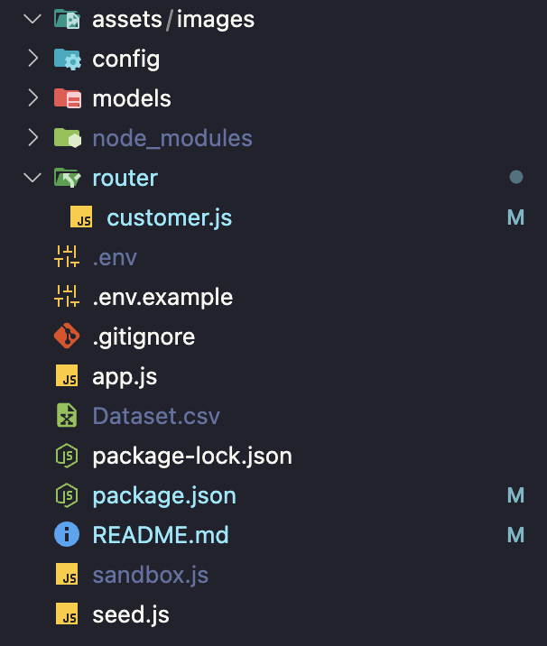

# Customer Analytics REST API

A Node.js/Express REST API for customer analytics using MongoDB, designed to handle customer data and provide comprehensive analytics with efficient handling of large datasets.

## Table of Contents

-   [Features](#features)
-   [Tech Stack](#tech-stack)
-   [Installation](#installation)
-   [Environment Setup](#environment-setup)
-   [API Endpoints](#api-endpoints)
-   [Performance Considerations](#performance-considerations)

## Features

-   **Customer Management**: Paginated customer listing with search functionality
-   **Analytics Engine**: Comprehensive customer analytics using email as unique user identifier
-   **Performance Optimized**: Efficient handling of large datasets with MongoDB aggregation
-   **Demographic Insights**: Age, gender, location, and device analytics
-   **Digital Behavior**: Digital interest and login hour analysis
-   **RESTful Design**: Clean, consistent API design following REST principles

## Tech Stack

-   **Backend**: Node.js, Express.js
-   **Database**: MongoDB with Mongoose ORM
-   **Environment**: dotenv for configuration
-   **CORS**: Cross-origin resource sharing enabled

## Installation

1. Clone the repository:

```bash
git clone <repository-url>
cd higo_backend
```

2. Install dependencies:

```bash
npm install
```

3. Set up environment variables (see [Environment Setup](#environment-setup))

4. Start the server:

```bash
# Development mode
npm run dev

# Production mode
npm start
```

## Environment Setup

Create a `.env` file in the root directory:

```env
MONGODB_URI=mongodb://localhost:27017/customer_analytics
PORT=3000
```

## SEEDING DATA FROM CSV FILE (IMPORTANT !)

First, you need to download the Dataset.csv file I've provided at the following link:

https://drive.google.com/file/d/1m5P_iL4HGiTy2Ii4FOj25r-gN7KaPjZX/view?usp=drive_link

Then, move the Dataset.csv file to the root folder of the application, as shown below. It should be aligned with package.json.



Then, run the seed.js file:

```
node --max-old-space-size=4096 seed.js
```

if you have an error for seeding data, you can up to 6144 or 8192 (if your RAM is bigger) :

```
node --max-old-space-size=8192 seed.js
```

Wait for the seeding process to complete, then check the MongoDB database when the seeding process is complete.

## API Endpoints

### Base URL

```
http://localhost:3000
```

### 1. Customer Listing

#### GET `/customers`

Get paginated list of customers with optional search functionality.

**Query Parameters:**

-   `page` (optional): Page number (default: 1)
-   `limit` (optional): Items per page (default: 20)

**Response:**

```json
{
    "page": 1,
    "limit": 20,
    "totalItems": 1000,
    "totalPages": 50,
    "data": [
        {
            "_id": "507f1f77bcf86cd799439011",
            "customerId": 12345,
            "locationName": "Jakarta",
            "date": "2024-01-15",
            "loginHour": "14:30",
            "fullName": "John Doe",
            "birthYear": 1990,
            "gender": "Male",
            "email": "john.doe@example.com",
            "phone": "+62812345678",
            "device": "Mobile",
            "digitalInterest": "Technology",
            "locationType": "Urban",
            "createdAt": "2024-01-15T08:00:00.000Z",
            "updatedAt": "2024-01-15T08:00:00.000Z"
        }
    ]
}
```

### 2. Analytics Endpoints

#### GET `/customers/statistics/summary`

Get comprehensive customer analytics summary with multiple uniqueness metrics.

**Features:**

-   Uses email as primary unique identifier for accurate user counting
-   Provides multiple count metrics for data analysis
-   Age and demographic breakdowns
-   Top digital interests, devices, and location types

**Response:**

```json
{
    "customerCounts": {
        "totalRecords": 10000,
        "uniqueByCustomerId": 8500,
        "uniqueByEmail": 9200,
        "uniqueByName": 7800,
        "uniqueByNameAndEmail": 9000
    },
    "totalCustomers": 9200,
    "demographics": {
        "age": {
            "average": 32.5,
            "min": 18,
            "max": 75
        },
        "birthYear": {
            "average": 1991,
            "min": 1949,
            "max": 2006
        },
        "gender": {
            "Male": 4600,
            "Female": 4400,
            "Other": 200
        }
    },
    "digitalInterests": [
        {
            "interest": "Technology",
            "count": 2500
        },
        {
            "interest": "Gaming",
            "count": 1800
        }
    ],
    "devices": [
        {
            "device": "Mobile",
            "count": 6000
        },
        {
            "device": "Desktop",
            "count": 2200
        }
    ],
    "locationTypes": [
        {
            "locationType": "Urban",
            "count": 7000
        },
        {
            "locationType": "Rural",
            "count": 2200
        }
    ]
}
```

#### GET `/customers/statistics/gender`

Get gender distribution using unique email-based counting.

**Response:**

```json
{
    "Male": 4600,
    "Female": 4400,
    "Other": 200
}
```

## Usage Examples

### Basic Customer Listing

```bash
# Get first page with default limit (20)
curl "http://localhost:3000/customers"

# Get page 2 with 50 items per page
curl "http://localhost:3000/customers?page=2&limit=50"
```

### Analytics Queries

```bash
# Get comprehensive summary
curl "http://localhost:3000/customers/statistics/summary"

# Get gender breakdown
curl "http://localhost:3000/customers/statistics/gender"
```

## Performance Considerations

### Email-Based Uniqueness

All analytics endpoints use **email as the primary unique identifier** to ensure accurate user counting. This approach:

-   Eliminates duplicate users across multiple records
-   Provides the most accurate representation of unique customers
-   Maintains consistency across all analytics endpoints

### Large Dataset Handling

-   **Pagination**: Implemented for customer listing to handle large datasets
-   **Aggregation**: Uses MongoDB aggregation for efficient analytics computation
-   **Selective fields**: Returns only necessary fields in responses
-   **Error handling**: Comprehensive error handling for production readiness

## Error Responses

All endpoints return consistent error responses:

```json
{
    "message": "Internal server error"
}
```

Common HTTP status codes:

-   `200`: Success
-   `500`: Internal Server Error

---
